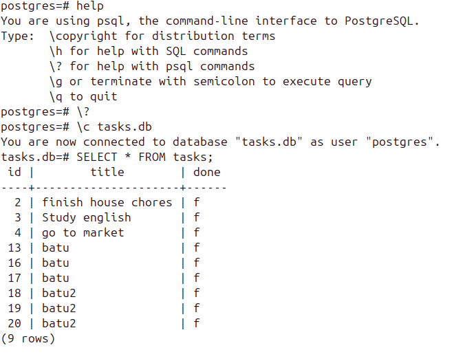
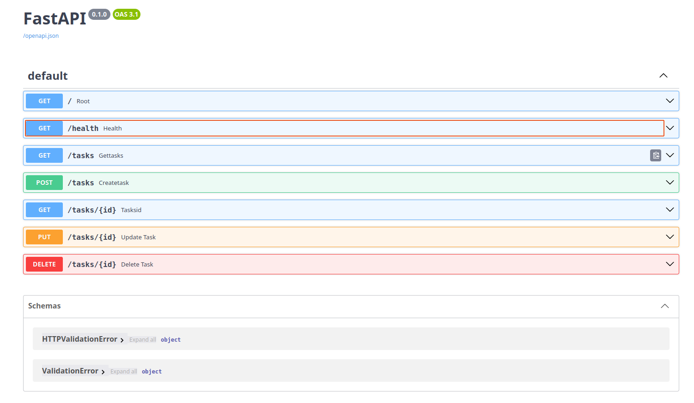

# FastAPI PostgreSQL Task API

A small asynchronous CRUD API built with Python, FastAPI, PostgreSQL, and
Psycopg 3. Tasks are stored in a PostgreSQL table and remain available after
the API restarts. The project supports task creation, reading, completion
filtering, updates, deletion, and interactive Swagger documentation.

## Technology

- Python and FastAPI
- PostgreSQL
- Psycopg 3 and `psycopg_pool.AsyncConnectionPool`
- `uv` for installing dependencies and running the development server

The connection pool opens during FastAPI startup and closes during shutdown.
Database settings are read from a local `database.ini` file, which is ignored
by Git so passwords are not committed.

## Project structure

```text
.
├── main.py                 # FastAPI routes and SQL queries
├── connect.py              # PostgreSQL async connection pool
├── config.py               # database.ini configuration loader
├── schema.sql              # tasks table definition
├── database.ini.example    # safe configuration template
├── requirements.txt        # Python dependencies
└── docs/
    ├── db.png              # PostgreSQL table screenshot
    └── swaggerui.png       # Swagger UI screenshot
```

## Prerequisites

- Python 3.10 or newer
- [uv](https://docs.astral.sh/uv/getting-started/installation/)
- A running PostgreSQL server with the `psql` command available

## Run locally from scratch

### 1. Clone the repository

```bash
git clone https://github.com/MBatuhanAltun/fastapi-task-api.git
cd fastapi-task-api
```

### 2. Create the PostgreSQL database and table

The following commands use PostgreSQL's default `postgres` administrator. Use
your own PostgreSQL user if your installation is configured differently.

```bash
createdb -U postgres tasks_db
psql -U postgres -d tasks_db -f schema.sql
```

You can verify the empty table with:

```bash
psql -U postgres -d tasks_db -c "SELECT * FROM tasks;"
```

The compatible table schema is:

```sql
CREATE TABLE IF NOT EXISTS tasks (
    id INTEGER GENERATED BY DEFAULT AS IDENTITY PRIMARY KEY,
    title VARCHAR(255) NOT NULL,
    done BOOLEAN NOT NULL DEFAULT FALSE
);
```

### 3. Configure the database connection

Copy the safe template:

```bash
cp database.ini.example database.ini
```

Windows PowerShell users can run:

```powershell
Copy-Item database.ini.example database.ini
```

Open `database.ini` and replace the values with your local PostgreSQL settings:

```ini
[postgresql]
host=localhost
port=5432
dbname=tasks_db
user=postgres
password=your_postgresql_password
```

Do not commit `database.ini`; it may contain a database password and is already
listed in `.gitignore`.

### 4. Start the API

From the repository directory, run:

```bash
uv run --with-requirements requirements.txt fastapi dev main.py
```

When the server is ready, these URLs are available:

- API: <http://127.0.0.1:8000>
- Health check: <http://127.0.0.1:8000/health>
- Tasks: <http://127.0.0.1:8000/tasks>
- Swagger UI: <http://127.0.0.1:8000/docs>
- OpenAPI JSON: <http://127.0.0.1:8000/openapi.json>

## Task data

Each PostgreSQL row contains these columns:

| Field | PostgreSQL type | Meaning |
|---|---|---|
| `id` | `INTEGER IDENTITY` | Automatically generated task ID |
| `title` | `VARCHAR(255)` | Task description |
| `done` | `BOOLEAN` | Whether the task is complete |

Psycopg currently returns database rows in column order, so task responses are
serialized as `[id, title, done]`, for example `[1, "Study", false]`.



## Endpoints

| Method | Endpoint | Description | Request body | Success |
|---|---|---|---|---|
| `GET` | `/` | Show API name and version | None | `200 OK` |
| `GET` | `/health` | Check whether the API is running | None | `200 OK` |
| `GET` | `/tasks` | Return all tasks; optionally filter by `done` | None | `200 OK` |
| `GET` | `/tasks/{id}` | Return one task by its PostgreSQL ID | None | `200 OK` |
| `POST` | `/tasks` | Insert a new task | `{"title": "Study"}` | `201 Created` |
| `PUT` | `/tasks/{id}` | Update a task | `{"title": "Study FastAPI", "done": true}` | `200 OK` |
| `DELETE` | `/tasks/{id}` | Delete a task | None | `204 No Content` |

An empty or invalid request body returns `400 Bad Request`. Requests for an
unknown task ID are intended to return `404 Not Found`.

### Filter tasks

```bash
# All tasks
curl http://127.0.0.1:8000/tasks

# Completed tasks
curl "http://127.0.0.1:8000/tasks?done=true"

# Open tasks
curl "http://127.0.0.1:8000/tasks?done=false"
```

### Create, update, and delete

```bash
# Create
curl -i -X POST http://127.0.0.1:8000/tasks \
  -H "Content-Type: application/json" \
  -d '{"title":"Learn PostgreSQL"}'

# Update
curl -i -X PUT http://127.0.0.1:8000/tasks/1 \
  -H "Content-Type: application/json" \
  -d '{"title":"Learn PostgreSQL pools","done":true}'

# Delete
curl -i -X DELETE http://127.0.0.1:8000/tasks/1
```

## Swagger UI

With the server running, open <http://127.0.0.1:8000/docs> to inspect every
route and send requests interactively.



## Troubleshooting

- `Section postgresql not found`: create `database.ini` from the provided
  template and keep the `[postgresql]` heading.
- `password authentication failed`: check the `user` and `password` values in
  `database.ini`.
- `database "tasks_db" does not exist`: run the `createdb` command in step 2.
- `relation "tasks" does not exist`: run `schema.sql` against the same database
  named in `database.ini`.
- Connection refused: confirm PostgreSQL is running and listening on the host
  and port in `database.ini`.

## AI vs me

> Historical note: this comparison records the earlier in-memory version of
> the project. The hand-built `main` branch was later migrated to PostgreSQL.

I kept my hand-built application on `main` and generated the AI implementation
on the separate `empty-branch`. The first AI attempt is commit `f8b67ff`; the
rematch is commit `5cdb3df`. None of the AI application code was copied into my
hand-built `main.py`.

### My full first prompt

```text
I want to write a api that uses PYTHON and fastapi it will have
tasks elements
data schema is
id 1 title Study done False
this is the example
get root function returns version of this api
and get health returns status
get tasks it has done query we can filter done or not done tasks
get task by id
create task
and update a task
and delete a task
also place related http status code all ensure data validation no db will be used data is in memory not disk also u will use a doc also for this requirements.txt for someone who doesnt know about this repo can run this in a few minutes make sure ethis readmd provides enough and simple info
```

### Run and checkpoint results

Both applications started on the first try in clean virtual environments. I
sent the same requests to each real Uvicorn server, including the Stage 4 CRUD
checks and the Stage 6 `done` filter.

| Check | My version | First AI version |
|---|---|---|
| Server starts and `/docs` loads | Pass | Pass |
| Root, health, task list, filtering, task lookup, and unknown-ID `404` | Pass | Pass, but root and health response bodies differ from mine |
| `POST /tasks` returns `201` with a boolean `done` value | Fail: it returns `"Pending"` | Pass: it returns `false` |
| Empty title returns `400 Bad Request` | Pass | Fail: it returns `422 Unprocessable Entity` |
| Empty update returns `400 Bad Request` | Pass | Fail: it returns `422 Unprocessable Entity` |
| `PUT /tasks/1` can update only `done` | Pass | Fail: the AI treated PUT as replacement and required `title` |
| Valid update of an unknown task returns `404` | Pass | Pass |
| Delete returns empty `204`; unknown delete returns `404` | Pass | Pass |
| Creating another task after a deletion still works | Fail: it returns `500` because an ID is used as a list index | Pass |

The side-by-side diff was substantial: the AI version added 156 lines and
removed 105 relative to my `main.py`. Most of the extra code is typed Pydantic
models, reusable lookup logic, and API metadata.

### What the AI did better

The AI used Pydantic request and response models, so the body shape appears
clearly in Swagger and invalid types are rejected before an endpoint mutates
data. I understand this approach: FastAPI parses the request into a model, then
passes a known-valid object to the route. It also stored tasks in a dictionary
and returned the newly created object directly. That avoided the bug in my
version where `tasks[id - 1]` crashes after a deletion. Finally, it correctly
kept `done` as a boolean instead of setting it to the string `"Pending"`.

### What the AI got wrong or ignored

The first AI version did not match my validation contract: it quietly accepted
FastAPI's default `422` responses instead of the required `400`. It interpreted
`PUT` as a full replacement, so a body such as `{"done": true}` failed even
though my API supports partial updates. It also changed the exact root and
health payloads, started with only one task instead of my three tasks, added an
unrequested `PATCH` endpoint, and added a `Location` header to create responses.

### What my prompt forgot to specify

My first prompt did not say whether `PUT` meant replacement or partial update,
which validation failures must be `400`, what the exact root and health bodies
should be, or whether the one shown task was an example or the complete seed
data. I also left whitespace handling, a title length limit, extra JSON fields,
and extra routes unspecified. The AI silently chose to trim titles, cap them at
200 characters, reject extra behavior through its models, and provide both PUT
and PATCH styles.

### Improved rematch prompt

```text
Create a second, quarantined implementation of my task API on the existing AI branch. Do not edit or copy code into the main branch.

Use Python 3.10 or newer and FastAPI. Keep all data only in memory; do not use a database or write task data to disk. Restarting the process must restore exactly these tasks:
- {"id": 1, "title": "Study", "done": false}
- {"id": 2, "title": "Read", "done": true}
- {"id": 3, "title": "Exercise", "done": true}

Implement exactly these application routes:
- GET / returns 200 and {"name": "Task API", "version": "1.0", "endpoints": ["tasks"]}.
- GET /health returns 200 and {"status": "OK"}.
- GET /tasks returns every task. An optional boolean done query parameter filters completed or incomplete tasks.
- GET /tasks/{id} returns 200 with the task, or 404 for an unknown positive ID.
- POST /tasks accepts a required title and an optional boolean done that defaults to false. It assigns a positive integer ID and returns 201 with the created task.
- PUT /tasks/{id} is a partial update: accept title, done, or both, preserve omitted fields, return 200, and return 404 for an unknown positive ID.
- DELETE /tasks/{id} returns 204 with no body, or 404 when the task does not exist.

Use Pydantic request and response models. A title must be a string that is not blank after trimming; trim surrounding whitespace before storing it and do not invent a maximum length. done must be a real JSON boolean. Missing fields, malformed JSON, null values, wrong types, unknown fields, and an empty PUT body must return 400 rather than FastAPI's default 422. Do not add PATCH or other application routes.

Keep ID generation correct even after tasks are deleted. Configure useful Swagger UI documentation at /docs. Add pinned runtime dependencies to requirements.txt and write a short README that lets a beginner create a virtual environment, install dependencies, run Uvicorn, find Swagger, and try the API within a few minutes. Run the CRUD, validation, filter, deletion-gap, and docs checks before finishing.
```

The rematch changed the AI version to match the exact seed data and system
responses, return `400`, support partial `PUT`, remove `PATCH`, and pass the
create-after-delete case while retaining typed validation and Swagger schemas.
